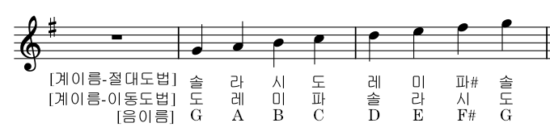

# 악보(Score) 보는 법 - 기본

## 음자리표 Clefs

https://blog.naver.com/1458music/220456313791

### 높음 음자리표 

### 낮은 음자리표

### 여러가지 음자리표

(Musescor 팔레트 이미지)

  * TAB : 타브(TAB)는 태블라추어(Tablature)의 줄임말이다. 주로 현악기의 운지법(運指法)을 표시하는 데 사용된다. (from 나무위키)

## 조표

### 조표 붙이는 순서

  * Flat (b) Key : 시 - 미 - 라 - 레 - 솔 - 도 - 파

  * Sharp (#) Key : 파 - 도 - 솔 - 레 - 라 - 미 - 시

### 이동도법 vs 절대도법

## 으뜸음과 조이름

  * 으뜸음이란? 
      * 해당 조성의 첫 출발음.
      * 이동도법에서의 도
  * 조성 (또는 조이름) Key

### 단조와 장조

https://blog.naver.com/viva1143/220910825873

#### 장조

  * "도"를 시작음(=으뜸음)으로 하는 음계

  * 대체로 밝은 분위기의 곡

  * 멜로디의 마지막음이 대체로 (이동도법)"도"로 끝남 

#### 단조

  * "라"를 시작음(=으뜸음)으로 하는 음계

  * 대체로 어두운 분위기의 곡

  * 멜로디의 마지막음이 대체로 (이동도법)"라"로 끝남

### 장조의 으뜸음과 조이름

https://blog.naver.com/1458music/223753202625

#### Flat (b) Key

  * 마지막 조표에서 4도 아래의 음 (자신을 포함하여 아래로 4칸 이동)

  * 예를 들어 "b"이 하나인 경우 현재 "시"에 조표가 있고, 아래로 4칸은 "파" 이므로, 으뜸음은 파(=F)(=바). 그러므로 "바장조" 또는 "F Major"

  * "b"이 두개 이상인 경우 직전의 조표의 자리가 4도 아래의 음이되어 고민없이 직전 조표의 음이 으뜸음이며 항상 Flat(b)이 붙어 있게 됨

  * 예를 들어 "b"이 세개인 경우 시-미-라 순서로 조표가 붙게되고, 마지막 조표 직전의 조표는 미의 자리이므로 으뜸음은 미(=E)(=마), Flat을 반영하여 "내림 마 장조" 또는 "Eb Major"

#### Sharp (#) Key 

  * 마지막 조표에서 2도 위의 음 (자신의 자리 바로 위 1칸)

  * 마지막 자신의 "#"이 붙어 있으므로 정확히는 반음위의 음

  * 예를 들어 "#" 두개인 경우 파-도 순서로 조표가 붙고, 마지막 조표의 자리는 "도". 그러므로 으뜸음은 바로위의 자리인 "레"(=D)(=라). 조이름은 "라장조" 또는 "D Major"

### 단조의 으뜸음과 조이름

  * 장조의 으뜸음을 포함하여 3칸 아래의 음 (정확히는 단3도 아래)

### 조표와 임시표

https://blog.naver.com/1458music/223047240717

  * 조표 : 별도로 조가 변경되는 표기가 나오기전까지 전체적으로 유효

  * 임시표 : 임시표가 붙은 음이후 한 마디내에서 유효
