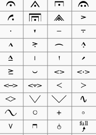
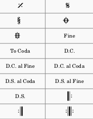
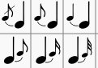
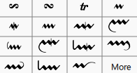
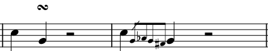
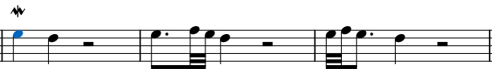
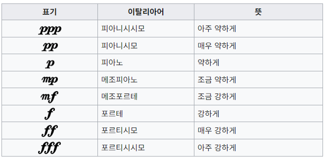
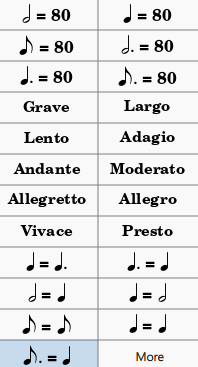

# 악상 기호, Musical Symbols

https://namu.wiki/w/%EC%95%85%EC%83%81%20%EA%B8%B0%ED%98%B8

https://en.wikipedia.org/wiki/List_of_musical_symbols

## 아티큘레이션 Articulation

https://blog.naver.com/1458music/222757611306

아티큘레이션(Articulation)은 '명료한 발음'이란 뜻으로, 음악에서는 연속되고 있는 선율을 보다 작은 단위로 구분하여 각각의 단위에 어떤 형과 의미를 부여하는 연주기법을 뜻한다. 한 이벤트의 음색, 셈여림표, 음높이를 바꿀 수 있다. (by Google)

즉, 하나의 음을 어떻게 연주할 것인가에 대한 추가적인 표

  * 페르마타 (Fermata) : 음표 길이를 2~3배로 늘려 연주
 
  * 레가토 (Legato) : 음표 사이에 끊김 없이 매끄럽게 연결하여 연주. 이음줄로 표현 (위 그림에 없음)

  * 스타카토 (Staccato): 음표를 짧게 끊어 연주. 음표 바로 위나 아래에 작은 점을 찍어 표현
 
  * 테누토 (Tenuto): 음표를 원래 셈여림보다 약간 더 길게 연주. 음표 위나 아래에 가로선으로 표현

  * 마르카토 (Marcato): 음을 한음 한음씩 강조해서 연주. 꺽쇄(^) 모양으로 표현

  * 악센트 (Accent): 표시한 음을 특기 세계 연주. 가로꺽쇄 (>) 모양으로 표현현

  * 글리산도: 음표를 매끄럽게 미끄러지듯이 연주. 물결모양 사선 화살표로 표현 (위 그림에 없음)

## 반복기호

https://blog.naver.com/1458music/223019060512

  * 도돌이표 : 이전 도돌이표로 돌아가 되풀이
  * 세뇨 : D.S 에 의해 돌아갈 자리
  * 코다 : 코다~코다 구간은 반복할때는 생략하여 연주
  * D.C (다가포) : 곡의 처음으로 이동
  * D.S (달세뇨) : 세뇨로 이동
  * Fine (피네) : 반복할 때 해당 지점에서 종료

## 꾸밈음

하나의 음을 장식하기 위해 그 음표의 앞이나 뒤에 붙이는 작은 음표 기호 또는 약속된 특별한 기호호

  * 턴 꾸밈음 Turn : 앞꾸밈음에 여러 음으로 구성된 꾸밈음

  

  * 모르덴트 Mordent : 해당음의 바로 위의 음을 짧게 연주하고 되돌아 옴. 정확한 표기법은 여러가지가 있을수 있으나 실제 연주의 음표를 간소화 표현.

  * 트릴 Trill: 2도 차이나는 음사이를 빠르게 전환하여 연주. 떤꾸밈음, 떤음

  ***기호는 작성자가 악보 표기를 간소화하기 위해 사용하므로, 원래의 의미 및 용도와 다르게 사용될수도 있음 (필자 의견)***

  ## 셈여림, Dynamic

  음의 세고 여림에 대한 표시

   * _p_ , 피아노, piano :  **약하게**
   * _f_ , 포르테, Forte : **강하게**

  https://ko.wikipedia.org/wiki/%EC%85%88%EC%97%AC%EB%A6%BC%ED%91%9C

## 빠르기 Tempo

  * Grave(그라베) : 장중하게 느리게
  * Lento(렌토) : 길게 끌어 느리게
  * Largo(라르고) : 폭넓고 여유롭게  (40–66 bpm)
  * Adagio(아다지오) : 침착하고 느리게(44–66 bpm)
  * Andante(안단테) : 모데라토보다 조금 느리게, 나아가듯이(56–108 bpm)
  * Moderato(모데라토) : 보통 빠르기로(108–120 bpm)
  * Allegretto(알레그레토) : 조금 빠르게
  * Allegro(알레그로) : 빠르게, 명량하게(120–156 bpm)
  * Vivace(비바체) : 화려하고 빠르게(156–176 bpm)
  * Presto(프레스토) : 아주 빠르게(168–200 bpm)
