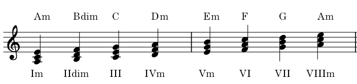

## 음정, Interval

음정(音程, interval)은 음악이론에서 두 음의 높이 차이, 즉 두 음 사이의 거리를 나타내는 용어이다. 두 음이 시차를 두고 순차적으로 울리는 것을 선율적 음정, 동시에 울리는 것을 화성적 음정이라고 한다

https://ko.wikipedia.org/wiki/%EC%9D%8C%EC%A0%95

  * 아래는 두음사이의 음정을 표시함

  * 두 음정간의 반음의 수에 따라 장,단, 감, 증, 완전,.... 등의 추가 수식어가 있음

  * 장음계에서 1, 4, 5, 8 (=일산오빠)은 "완전", 그외 2,3,6,7은 "장"

  * "완전"에서 반음이 늘어나면 "증", 감소하면 "감"
  
  * "장"에서 반음이 줄어들면 "단", 늘어나면 증

  * 자세한 것은 위키피디아의 설명으로 충분할 것 같습니다.

## 화음, 코드, Chord

높이가 다른 2개 이상의 음이 동시에 울렸을때의 합성음

### 다이어토닉 3화음, Diatonic Triad

  * 다이어토닉 : 해당 음계의 스케일의 구성음으로만 이루어진 코드
  * Triad : 1도, 3도, 5도의 3개음으로 이루어진 코드

#### 장음계의 다이어토닉 3화음

_※ VII 화음음 불협화음이라 일반적으로 잘 사용되지 않고, 재즈 등에서 7도가 추가된 코드로 주로 사용됨됨 !!_

#### 단음계의 다이어토닉 3화음

  * _단음계는 Harmonic, Melodic, ... 단음계에 따라 구성이 달라짐... 여기부턴 Skip_

#### C음을 으뜸음으로 하는 다양한 코드들

  * 1-3, 3-5간의 간격에 따라 
     * Major : 장3도, 단3도
     * Minor : 단3도, 장3도
  *그외 추가되는 음에 따라 여러가지 표기가 있음

### 토닉, 도미넌트

  * 토닉 : 1도음의 화음, 그조의 기본이 되는 코드, 대부분의 곡은 토닉으로 끝남

  * 도미넌트 : 5도음의 화음, 토닉으로 가려는 성질을 가짐

  * 서브 도미넌트 : 4도음의 화음

## 5도권, Circle of fifths

  * 조(Key)의 관계를 도표로 표시한 그림.
  * 오른쪽 방향으로 조표의 "#"이 붙는 것에 따라 완전 5도씩 올라감 (=완전 4도 내려감)
  * 왼쪽 방향으로 조표의 "b'이 붙는 것에 따라 완전 5도씩 내려감 (=완전4도 올라감)

https://namu.wiki/w/5%EB%8F%84%EA%B6%8C

### 이해 및 활용

  * 원의 바깥쪽에 메이저 코드가 표시되고, 안쪽에 마이너 코드가 표시됨
  * 예를 들어 C Key의 경우 좌우로 F,G, 마이너로 Am, Dm, Em 가 다이어토닉 코드
  * 예를 들어 G Key의 경우 좌우로 C,D, 마이너로 Em, Am, Bm 가 다이어토닉 코드
  * Eb 악기(알토색소폰)의 경우 Piano C key 기준으로 좌측으로 3칸 차이가 나므로 연주시 우측 세칸에 있는 음을 연주하면 Piano 와 동일
  * Bb 악기(소프라노색소폰)의 경우 2칸 차이
  * Eb - Bb의 한칸차이
  * 올림의 조표가 2개 붙을때마다 장2도가 상승함
  * 재즈 등 즉흥 연주에서 사용하는 2 - 5 - 1 진행을 도표로 이해하면 활용이 용이 (왼쪽 - 오른쪽 - 가운데)
  
